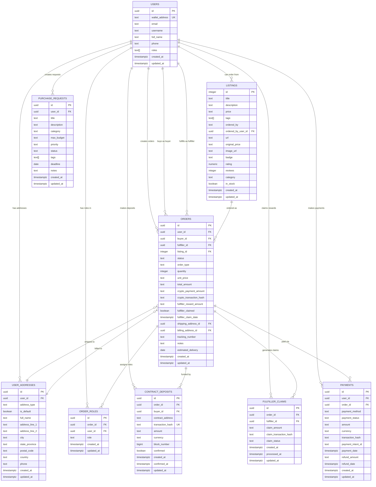

# Database Schema Documentation

## Collections Overview

Your e-commerce platform consists of **9 main collections** that work together to handle users, products, orders, payments, and dual-role order fulfillment:

```
📊 Database Statistics
├── users: 3 rows
├── listings: 14 rows
├── orders: 3 rows
├── user_addresses: 3 rows
├── purchase_requests: 3 rows
├── payments: 0 rows
├── order_roles: 3 rows
├── contract_deposits: 1 row
└── fulfiller_claims: 0 rows
```

---

## 🔗 Entity Relationship Diagram



---

## 📋 Detailed Collection Schemas

### 1. **Users** (`users`)

**Core user profiles with wallet integration and role management**

| Field            | Type        | Constraints       | Description             |
| ---------------- | ----------- | ----------------- | ----------------------- |
| `id`             | UUID        | PRIMARY KEY       | Unique user identifier  |
| `wallet_address` | TEXT        | UNIQUE, NOT NULL  | Ethereum wallet address |
| `email`          | TEXT        | NULLABLE          | User email address      |
| `username`       | TEXT        | NULLABLE          | Display username        |
| `full_name`      | TEXT        | NULLABLE          | Full legal name         |
| `phone`          | TEXT        | NULLABLE          | Phone number            |
| `roles`          | TEXT[]      | DEFAULT ['buyer'] | User roles array        |
| `created_at`     | TIMESTAMPTZ | DEFAULT NOW()     | Account creation time   |
| `updated_at`     | TIMESTAMPTZ | AUTO-UPDATE       | Last modification time  |

**User Roles:**

- `buyer` - Can create orders and pay with crypto
- `fulfiller` - Can fulfill orders and claim rewards

**Key Features:**

- ✅ Row Level Security enabled
- ✅ Unique wallet address enforcement
- ✅ Auto-updating timestamps
- ✅ Multi-role support per user

---

### 2. **Listings** (`listings`)

**Product/service listings available for purchase**

| Field                | Type         | Constraints                 | Description                     |
| -------------------- | ------------ | --------------------------- | ------------------------------- |
| `id`                 | INTEGER      | PRIMARY KEY, AUTO-INCREMENT | Listing identifier              |
| `title`              | TEXT         | NOT NULL                    | Product title                   |
| `description`        | TEXT         | NULLABLE                    | Product description             |
| `price`              | TEXT         | NOT NULL                    | Current offer price             |
| `tags`               | TEXT[]       | NULLABLE                    | Product tags array              |
| `ordered_by`         | TEXT         | NULLABLE                    | Legacy order field              |
| `ordered_by_user_id` | UUID         | FK → users.id               | User who ordered                |
| `url`                | TEXT         | NULLABLE                    | Product source URL              |
| `original_price`     | TEXT         | NULLABLE                    | Original retail price           |
| `image_url`          | TEXT         | NULLABLE                    | Product image URL               |
| `badge`              | TEXT         | NULLABLE                    | Display badge (Sale, New, etc.) |
| `rating`             | NUMERIC(2,1) | DEFAULT 0                   | Average rating                  |
| `reviews`            | INTEGER      | DEFAULT 0                   | Number of reviews               |
| `category`           | TEXT         | NULLABLE                    | Product category                |
| `in_stock`           | BOOLEAN      | DEFAULT TRUE                | Stock availability              |

**Indexes:**

- `category`, `tags` (GIN), `in_stock`, `created_at`, `ordered_by_user_id`

---

### 3. **Orders** (`orders`)

**Dual-role order management and tracking system**

| Field                     | Type        | Constraints                | Description                 |
| ------------------------- | ----------- | -------------------------- | --------------------------- |
| `id`                      | UUID        | PRIMARY KEY                | Order identifier            |
| `user_id`                 | UUID        | FK → users.id, NOT NULL    | Order creator (legacy)      |
| `buyer_id`                | UUID        | FK → users.id              | User who pays with crypto   |
| `fulfiller_id`            | UUID        | FK → users.id              | User who fulfills with card |
| `listing_id`              | INTEGER     | FK → listings.id, NOT NULL | Ordered product             |
| `status`                  | TEXT        | CHECK constraint           | Order status                |
| `order_type`              | TEXT        | CHECK constraint           | 'purchase' or 'request'     |
| `quantity`                | INTEGER     | DEFAULT 1                  | Order quantity              |
| `unit_price`              | TEXT        | NOT NULL                   | Price per unit              |
| `total_amount`            | TEXT        | NOT NULL                   | Total order value           |
| `crypto_payment_amount`   | TEXT        | NULLABLE                   | Crypto deposit amount       |
| `crypto_transaction_hash` | TEXT        | NULLABLE                   | Crypto transaction hash     |
| `fulfiller_reward_amount` | TEXT        | NULLABLE                   | Reward for fulfiller        |
| `fulfiller_claimed`       | BOOLEAN     | DEFAULT FALSE              | Reward claimed status       |
| `fulfiller_claim_date`    | TIMESTAMPTZ | NULLABLE                   | When reward was claimed     |
| `shipping_address_id`     | UUID        | FK → user_addresses.id     | Shipping address            |
| `billing_address_id`      | UUID        | FK → user_addresses.id     | Billing address             |
| `tracking_number`         | TEXT        | NULLABLE                   | Shipment tracking           |
| `notes`                   | TEXT        | NULLABLE                   | Order notes                 |
| `estimated_delivery`      | DATE        | NULLABLE                   | Expected delivery date      |

**Status Flow:**

1. `pending_fulfillment` - Buyer paid, waiting for fulfiller
2. `fulfiller_assigned` - Fulfiller accepted the order
3. `fulfiller_processing` - Fulfiller is purchasing the item
4. `shipped` - Item has been shipped
5. `delivered` - Item delivered to buyer
6. `completed` - Order completed, fulfiller can claim
7. `cancelled` - Order cancelled
8. `disputed` - Order under dispute

**Order Types:**

- `purchase` - Direct product purchase
- `request` - User-initiated purchase request

---

### 4. **User Addresses** (`user_addresses`)

**Shipping and billing address management**

| Field            | Type    | Constraints             | Description             |
| ---------------- | ------- | ----------------------- | ----------------------- |
| `id`             | UUID    | PRIMARY KEY             | Address identifier      |
| `user_id`        | UUID    | FK → users.id, NOT NULL | Address owner           |
| `address_type`   | TEXT    | CHECK constraint        | 'shipping' or 'billing' |
| `is_default`     | BOOLEAN | DEFAULT FALSE           | Default address flag    |
| `full_name`      | TEXT    | NOT NULL                | Recipient name          |
| `address_line_1` | TEXT    | NOT NULL                | Street address          |
| `address_line_2` | TEXT    | NULLABLE                | Apartment/suite         |
| `city`           | TEXT    | NOT NULL                | City                    |
| `state_province` | TEXT    | NOT NULL                | State/province          |
| `postal_code`    | TEXT    | NOT NULL                | ZIP/postal code         |
| `country`        | TEXT    | NOT NULL                | Country                 |
| `phone`          | TEXT    | NULLABLE                | Contact phone           |

---

### 5. **Payments** (`payments`)

**Payment processing and tracking**

| Field               | Type        | Constraints              | Description             |
| ------------------- | ----------- | ------------------------ | ----------------------- |
| `id`                | UUID        | PRIMARY KEY              | Payment identifier      |
| `user_id`           | UUID        | FK → users.id, NOT NULL  | Paying user             |
| `order_id`          | UUID        | FK → orders.id, NOT NULL | Related order           |
| `payment_method`    | TEXT        | CHECK constraint         | Payment method type     |
| `payment_status`    | TEXT        | CHECK constraint         | Payment status          |
| `amount`            | TEXT        | NOT NULL                 | Payment amount          |
| `currency`          | TEXT        | DEFAULT 'USD'            | Currency code           |
| `transaction_hash`  | TEXT        | NULLABLE                 | Crypto transaction hash |
| `payment_intent_id` | TEXT        | NULLABLE                 | Stripe payment intent   |
| `payment_date`      | TIMESTAMPTZ | NULLABLE                 | Payment completion date |
| `refund_amount`     | TEXT        | NULLABLE                 | Refunded amount         |
| `refund_date`       | TIMESTAMPTZ | NULLABLE                 | Refund date             |

**Payment Methods:**

- `crypto`, `card`, `bank_transfer`, `paypal`

**Payment Status:**

- `pending`, `processing`, `completed`, `failed`, `refunded`

---

### 6. **Purchase Requests** (`purchase_requests`)

**User-initiated purchase requests**

| Field         | Type   | Constraints             | Description         |
| ------------- | ------ | ----------------------- | ------------------- |
| `id`          | UUID   | PRIMARY KEY             | Request identifier  |
| `user_id`     | UUID   | FK → users.id, NOT NULL | Requesting user     |
| `title`       | TEXT   | NOT NULL                | Request title       |
| `description` | TEXT   | NULLABLE                | Request description |
| `category`    | TEXT   | NULLABLE                | Product category    |
| `max_budget`  | TEXT   | NULLABLE                | Maximum budget      |
| `priority`    | TEXT   | CHECK constraint        | Request priority    |
| `status`      | TEXT   | CHECK constraint        | Request status      |
| `tags`        | TEXT[] | NULLABLE                | Request tags        |
| `deadline`    | DATE   | NULLABLE                | Required by date    |
| `notes`       | TEXT   | NULLABLE                | Additional notes    |

**Priority Levels:**

- `low`, `medium`, `high`, `urgent`

**Request Status:**

- `open`, `in_progress`, `fulfilled`, `cancelled`

---

### 7. **Order Roles** (`order_roles`)

**Track user roles in specific orders**

| Field        | Type        | Constraints              | Description                |
| ------------ | ----------- | ------------------------ | -------------------------- |
| `id`         | UUID        | PRIMARY KEY              | Role assignment identifier |
| `order_id`   | UUID        | FK → orders.id, NOT NULL | Associated order           |
| `user_id`    | UUID        | FK → users.id, NOT NULL  | User with role             |
| `role`       | TEXT        | CHECK constraint         | User role in order         |
| `created_at` | TIMESTAMPTZ | DEFAULT NOW()            | Role assignment time       |
| `updated_at` | TIMESTAMPTZ | AUTO-UPDATE              | Last modification time     |

**Role Types:**

- `buyer` - Pays with crypto, full order visibility
- `fulfiller` - Pays with card, limited visibility + claim rewards

**Unique Constraint:** (order_id, user_id, role) - Prevents duplicate role assignments

---

### 8. **Contract Deposits** (`contract_deposits`)

**Crypto payment tracking and verification**

| Field              | Type        | Constraints              | Description                 |
| ------------------ | ----------- | ------------------------ | --------------------------- |
| `id`               | UUID        | PRIMARY KEY              | Deposit identifier          |
| `order_id`         | UUID        | FK → orders.id, NOT NULL | Associated order            |
| `buyer_id`         | UUID        | FK → users.id, NOT NULL  | Depositing user             |
| `contract_address` | TEXT        | NOT NULL                 | Smart contract address      |
| `transaction_hash` | TEXT        | UNIQUE, NOT NULL         | Blockchain transaction hash |
| `amount`           | TEXT        | NOT NULL                 | Deposit amount              |
| `currency`         | TEXT        | DEFAULT 'ETH'            | Cryptocurrency type         |
| `block_number`     | BIGINT      | NULLABLE                 | Block number of transaction |
| `confirmed`        | BOOLEAN     | DEFAULT FALSE            | Confirmation status         |
| `created_at`       | TIMESTAMPTZ | DEFAULT NOW()            | Deposit creation time       |
| `confirmed_at`     | TIMESTAMPTZ | NULLABLE                 | When deposit was confirmed  |
| `updated_at`       | TIMESTAMPTZ | AUTO-UPDATE              | Last modification time      |

**Key Features:**

- ✅ Unique transaction hash enforcement
- ✅ Confirmation tracking
- ✅ Multi-currency support

---

### 9. **Fulfiller Claims** (`fulfiller_claims`)

**Reward claim management for fulfillers**

| Field                    | Type        | Constraints              | Description               |
| ------------------------ | ----------- | ------------------------ | ------------------------- |
| `id`                     | UUID        | PRIMARY KEY              | Claim identifier          |
| `order_id`               | UUID        | FK → orders.id, NOT NULL | Associated order          |
| `fulfiller_id`           | UUID        | FK → users.id, NOT NULL  | Fulfiller claiming reward |
| `claim_amount`           | TEXT        | NOT NULL                 | Amount being claimed      |
| `claim_transaction_hash` | TEXT        | NULLABLE                 | Claim transaction hash    |
| `claim_status`           | TEXT        | CHECK constraint         | Claim processing status   |
| `created_at`             | TIMESTAMPTZ | DEFAULT NOW()            | Claim initiation time     |
| `processed_at`           | TIMESTAMPTZ | NULLABLE                 | When claim was processed  |
| `updated_at`             | TIMESTAMPTZ | AUTO-UPDATE              | Last modification time    |

**Claim Status:**

- `pending` - Claim initiated
- `processing` - Being processed
- `completed` - Successfully claimed
- `failed` - Claim failed

---

## 🔄 Key Relationships

### **One-to-Many Relationships:**

1. **Users → User Addresses**: One user can have multiple shipping/billing addresses
2. **Users → Orders (as buyer)**: One user can be buyer in multiple orders
3. **Users → Orders (as fulfiller)**: One user can fulfill multiple orders
4. **Users → Order Roles**: One user can have roles in multiple orders
5. **Users → Contract Deposits**: One user can make multiple crypto deposits
6. **Users → Fulfiller Claims**: One user can claim rewards from multiple orders
7. **Users → Payments**: One user can make multiple payments
8. **Users → Purchase Requests**: One user can create multiple purchase requests
9. **Listings → Orders**: One listing can be ordered multiple times
10. **Orders → Order Roles**: One order can have multiple user roles (buyer + fulfiller)
11. **Orders → Contract Deposits**: One order can have multiple deposit attempts
12. **Orders → Fulfiller Claims**: One order can have multiple claim attempts
13. **Orders → Payments**: One order can have multiple payment attempts

### **Many-to-One Relationships:**

1. **Orders → Users (creator)**: Many orders belong to one creator
2. **Orders → Users (buyer)**: Many orders can have the same buyer
3. **Orders → Users (fulfiller)**: Many orders can have the same fulfiller
4. **Orders → Listings**: Many orders can reference one listing
5. **Orders → Shipping Address**: Many orders can use one address
6. **Orders → Billing Address**: Many orders can use one address
7. **Order Roles → Orders**: Many role assignments belong to one order
8. **Order Roles → Users**: Many role assignments can belong to one user
9. **Contract Deposits → Orders**: Many deposits can be for one order
10. **Contract Deposits → Users**: Many deposits can be from one user
11. **Fulfiller Claims → Orders**: Many claims can be for one order
12. **Fulfiller Claims → Users**: Many claims can be from one fulfiller

### **Dual-Role Order Flow:**

```
Buyer (Crypto) ──► Order Created ──► Fulfiller (Card) ──► Order Completed ──► Claim Rewards
     │                   │                   │                   │                   │
     ▼                   ▼                   ▼                   ▼                   ▼
Contract Deposit ──► Order Roles ──► Purchase Item ──► Update Status ──► Fulfiller Claims
```

---

## 🔒 Security Features

- ✅ **Row Level Security (RLS)** enabled on all tables
- ✅ **Foreign Key Constraints** ensure data integrity
- ✅ **Check Constraints** validate enum values
- ✅ **Unique Constraints** on wallet addresses
- ✅ **Automatic Timestamps** with triggers
- ✅ **Indexes** for performance optimization

---

## 📊 Current Data Summary

- **3 Users** with wallet addresses, profiles, and role assignments
- **14 Listings** (12 from mock data + 2 additional)
- **3 Orders** in various stages (fulfiller_processing, shipped, delivered)
- **3 Shipping addresses** for users
- **3 Purchase requests** (1 fulfilled, 2 open)
- **0 Payments** (ready for payment processing)
- **3 Order roles** (buyer assignments for existing orders)
- **1 Contract deposit** (crypto payment tracking)
- **0 Fulfiller claims** (ready for reward claiming)

## 🚀 New Dual-Role Features

### **Order Flow Enhancement:**

1. **Buyer Journey**: Connect wallet → Create order → Deposit crypto → Track full order details
2. **Fulfiller Journey**: Browse orders → Accept order → Purchase with card → Claim crypto rewards
3. **Permission System**: Role-based access to order information and actions
4. **Reward Mechanism**: Automatic reward calculation and claiming system

### **Role-Based Permissions:**

- **Buyers**: Full order visibility, shipping tracking, deposit status
- **Fulfillers**: Limited order visibility, reward claiming, fulfillment status

### **Crypto Integration:**

- Smart contract deposit tracking
- Transaction confirmation monitoring
- Automated reward distribution
- Multi-currency support (ETH, etc.)

This enhanced schema provides a complete foundation for a dual-role e-commerce platform with Web3 integration, supporting crypto-funded orders fulfilled by card payments, with automated reward systems for fulfillers.
