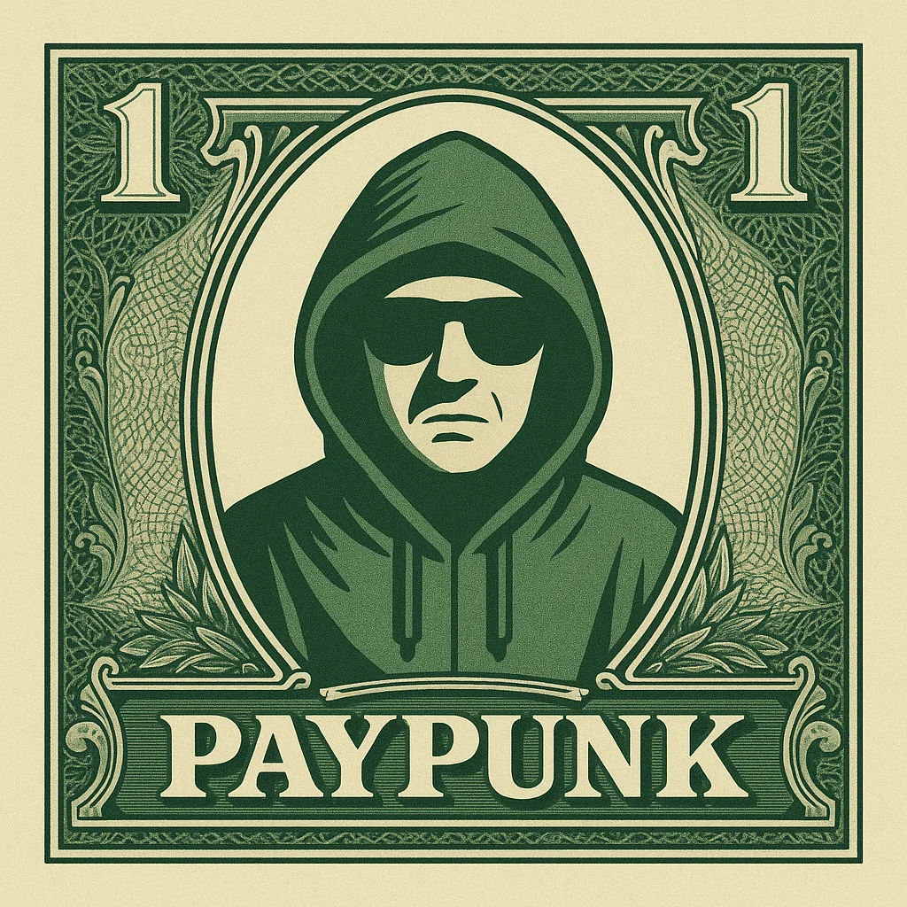

<h1 align="center">
💳🤘 PayPunk 🤘💳
</h1>

<h4 align="center">
  <p align="center">
    
  </p>
</h4>

## About 🎸

**PayPunk** is the decentralized marketplace that's **actually** bridging crypto to real-world physical goods. No more routing through Visa cards and reintroducing the banking system crypto was supposed to replace. We're cutting out the middleman and doing it right. 🚀

### The Problem 😤

Right now, **every single** payment solution from crypto to real-world physical goods gets routed through Visa cards. That's right - we're using crypto to escape traditional finance, only to route it back through the same centralized systems we were trying to escape. It's backwards, it's broken, and it's time to fix it. 💸

### The Solution 🔥

PayPunk enables **true** crypto-to-physical-goods transactions through a trustless, decentralized escrow system powered by zero-knowledge proofs and cross-chain interoperability. No banks. No cards. Just pure, decentralized magic. ✨

## How It Works 🎯

### 1. **Create a Listing** 📝✨
Users upload a listing and specify:
- 🛍️ What they want to buy (from Shopify)
- 💰 How much they're willing to pay in USDC (with a slight premium for the service)
- 🔐 Their private delivery credentials (encrypted, obviously)

### 2. **Lock Funds** 🔒💎
Once a listing is created, the user's USDC gets deposited and locked into our **[EVVM](https://www.evvm.org/)** (Ethereum Virtual Machine Virtual Machine) contract. The funds stay locked in escrow until the purchase is verified - no funny business. 🎪

### 3. **Browse & Purchase** 🛒🎁
Anyone can browse available listings and decide to fulfill a purchase. The buyer uses their own payment method (credit card, debit card, or whatever works) to purchase the item from Shopify and have it delivered to the original requester. Simple as that. 🎉

### 4. **Prove Purchase & Delivery** ✅🔍
After completing the purchase and ensuring delivery, the buyer uploads a **zero-knowledge proof** generated from **[vlayer](https://www.vlayer.xyz/)** that cryptographically verifies:
- ✅ The purchase was made
- 📦 The item was delivered to the correct recipient

All without revealing sensitive details. Privacy-first, baby! 🕵️‍♂️

### 5. **Unlock & Transfer** 💰🚀
Once the ZK proof is submitted and verified on our contract, the locked funds unlock and become withdrawable **only** by the buyer (the person who fulfilled the purchase). Fair is fair. ⚖️

### 6. **Automated Payout** 🤖⚡
When funds are unlocked, a background bot catches this event and automatically pays out the tokens to the new owner using **x402**. Seamless, automated, and beautiful. 🎨

## Cross-Chain Support 🌉🌍

PayPunk meets users where they're at. Users can create listings from **any chain** using **any token**. Through the **[Ethereum Interoperability Layer (EIL)](https://blog.ethereum.org/2025/11/18/eil)**, PayPunk automatically:
- 🔄 Swaps tokens to the required payment token
- 🌉 Bridges assets across chains
- 📋 Lists your request seamlessly

No more being locked into one chain or one token. Freedom, baby! 🗽

## Technology Stack 🛠️⚡

### Core Technologies 🔧

- **[EVVM](https://www.evvm.org/) (Ethereum Virtual Machine Virtual Machine)** 🎪: Our secure escrow contract for locking and managing funds. We've built a custom EVVM service that handles the entire escrow lifecycle, from deposit to withdrawal, with async nonce support for efficient transaction processing. It's like a blockchain within a blockchain. Mind-blowing stuff. 🧠
- **[vlayer](https://www.vlayer.xyz/)** 🔐: Zero-knowledge proof generation and verification for purchase and delivery confirmation. We use vlayer's Web Prover Server to generate ZK proofs that verify purchase and delivery without revealing sensitive information. Privacy-preserving verification at its finest. 🎭
- **x402** 🤖: Automated token payout system for seamless transfers when funds are unlocked. Set it and forget it. 🚀
- **[EIL (Ethereum Interoperability Layer)](https://blog.ethereum.org/2025/11/18/eil)** 🌉: Cross-chain token swaps and bridging infrastructure, enabling users to list from any chain with any token. Chain abstraction done right. 🎯

### Smart Contracts 📜

- **Treasury.sol** 💼: The main contract handling deposits, withdrawals, listing creation, and purchase verification. It's the brain of the operation. 🧠
- **[EVVM](https://www.evvm.org/) Integration** 🎪: Our custom EVVM service for secure, scalable fund management. Virtual blockchain magic. ✨
- **RISC Zero & [vlayer](https://www.vlayer.xyz/) Verification** 🔍: ZK proof verification using RISC Zero verifier contracts combined with vlayer's Web Prover Server. We use vlayer to generate the proofs and RISC Zero to verify them on-chain. Trust, but verify - with style! 🛡️✨

## Features 🎨

- 🔐 **Trustless Escrow**: Funds are locked in a smart contract until delivery is proven. No trust needed. 🎯
- 🔒 **Privacy-Preserving**: Private credentials are encrypted and only revealed when necessary. Your data, your control. 🛡️
- ✅ **ZK-Proof Verification**: Cryptographic proof of purchase and delivery without revealing sensitive details. Math that protects you. 🔢
- 🌉 **Multi-Chain Support**: List from any chain, pay with any token via [EIL](https://blog.ethereum.org/2025/11/18/eil). Chain-agnostic freedom. 🌍
- 🤖 **Automated Payouts**: Background bot handles token transfers seamlessly via x402. Automation that works. ⚡
- 💳 **Payment Flexibility**: Buyers can use any payment method (cards, crypto, etc.). Options, options, options. 🎁

## Architecture 🏗️

### Listing Flow 📝
```
User → Create Listing → Lock USDC in EVVM → Listing Published 🎉
```

### Purchase Flow 🛒
```
Buyer → Browse Listings → Purchase with Card → Generate ZK Proof (vlayer) → Submit Proof → Funds Unlocked → Auto Payout via x402 🚀
```

### Cross-Chain Flow 🌉
```
User (Chain A, Token X) → EIL Swap & Bridge → USDC on Target Chain → Listing Created ✨
```

## Bounties & Grants 🏆🎯

### [EVVM](https://www.evvm.org/) - Your Custom Service or EVVM Chain ⚙️🎪
**Track**: Custom Service or EVVM Chain

We've built a **custom [EVVM](https://www.evvm.org/) service** that handles the entire escrow lifecycle for PayPunk. Our Treasury contract integrates with our custom EVVM to provide:
- 🔒 Secure fund locking and unlocking
- ⚡ Async nonce support for efficient transaction processing
- 🎯 Full control over the escrow mechanism

**Deployment**: 
- Treasury Contract: See deployments section below 📍

### [vlayer](https://www.vlayer.xyz/) - Best ZK Proving dApp 🧠🔐
**Track**: Best ZK Proving dApp

PayPunk uses [vlayer](https://www.vlayer.xyz/)'s Web Prover Server to generate zero-knowledge proofs that verify:
- ✅ Purchase confirmation from Shopify
- 📦 Delivery verification to the correct recipient
- 🔒 Privacy-preserving verification without exposing sensitive user data

Our implementation uses both the Prover and Verifier smart contracts, with RISC Zero contract deployment for on-chain verification. ZK magic in action! ✨

### Ethereum Foundation - Best use of the [EIL](https://blog.ethereum.org/2025/11/18/eil) SDK 🧱🌉
**Track**: Best use of the EIL SDK

PayPunk leverages the [EIL](https://blog.ethereum.org/2025/11/18/eil) SDK to enable **seamless cross-chain token movement**. Users can create listings from any chain using any token, and PayPunk automatically:
- 🔄 Swaps tokens to USDC using [EIL](https://blog.ethereum.org/2025/11/18/eil)
- 🌉 Bridges assets across multiple L2 chains
- 🎨 Provides a seamless UX regardless of the user's chain or token preference

This demonstrates **true chain abstraction**, allowing users to interact with PayPunk from any Ethereum-compatible chain without friction. No more chain lock-in! 🗽

## Getting Started 🚀

### Prerequisites 📋

- 📦 Node.js and npm/yarn
- 🔨 Foundry (for smart contract development)
- 🎪 Access to [EVVM](https://www.evvm.org/) for custom EVVM deployment
- 🔐 [vlayer](https://www.vlayer.xyz/) API access (for ZK proof generation)
- 🌉 [EIL](https://blog.ethereum.org/2025/11/18/eil) SDK for cross-chain operations

### Installation 💻

```bash
# Clone the repository
git clone <repository-url>
cd cyphermarket

# Install dependencies
npm install

# Compile contracts
forge build

# Run tests
forge test
```

### Deployment 🚀

```bash
# Deploy to Base Sepolia testnet using EVVM init script
./evvm-init.sh
```

This script handles the full deployment process including EVVM setup and contract deployment. 🎯

### Testnet Deployments 🧪

**Base Sepolia** 🎯:
- 💼 Treasury: See `deployments/84532/` for latest addresses
- 🎪 [EVVM](https://www.evvm.org/) Integration: Custom EVVM service deployed for escrow management

_Mainnet deployment addresses will be added after launch_ 🚀

## Future Enhancements 🔮

- 🛍️ Support for additional e-commerce platforms beyond Shopify
- 🔍 Enhanced ZK proof schemas for more complex verification scenarios
- ⭐ Reputation system for buyers and sellers
- 📦 Multi-item batch purchases
- 💳 Integration with additional payment rails
- 📱 Mobile app for seamless on-the-go purchases

## License 📜

This project is licensed under the EVVM-NONCOMMERCIAL-1.0 License.  
Full license terms available at: https://www.evvm.info/docs/EVVMNoncommercialLicense

## Contributing 🤝

Contributions are welcome! Please feel free to submit a Pull Request. Let's build something awesome together! 🚀

## Team 👥

Built with ❤️🔥 by the PayPunk team:

- [@NevvDevv](https://x.com/NevvDevv) 🚀
- [@nhestrompia](https://x.com/nhestrompia) 💻
- [@0xjsieth](https://x.com/0xjsieth) ⚡

---

**PayPunk**: Decentralizing payments, one purchase at a time. 💳✨🤘
